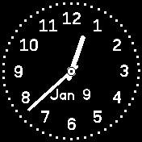

# banglejs-2-analog-clock-construction-kit #

a simple "kit" to easily construct individual analog clocks for a Bangle.js 2

Developing an "analog clock" for the [Bangle.js 2](https://www.espruino.com/Bangle.js2) may not be too complicated - but it still requires some knowledge of JavaScript in general and the [Bangle.js environment](https://www.espruino.com/Reference) in particular.

And quite often, an existing clock already comes quite close to what one would like to see - wouldn't there be the small missing detail one cannot live without...

This kit tries to simplify development and customization of such clocks by splitting the implementation into commonly seen parts and providing a framework into which all these parts fit.

As a consequence, people may easily combine already existing (and tested) parts in order to get the desired clock and - if this approach is not already sufficient - to customize or implement only those parts which cannot yet be found elsewhere.

## Common Structure of an Analog Clock ##

The typical structure of an analog clock looks as follows:

```
  let ClockMechanics = require('https://raw.githubusercontent.com/rozek/banglejs-2-simple-clock-mechanics/main/ClockMechanics.js');

  ClockMechanics.windUp({
    size:      require('https://raw.githubusercontent.com/rozek/banglejs-2-smart-clock-size/main/ClockSize.js'),
    background:null,
    face:      require('https://raw.githubusercontent.com/rozek/banglejs-2-twelve-fold-face/main/ClockFace.js'),
    hands:     require('https://raw.githubusercontent.com/rozek/banglejs-2-hollow-clock-hands/main/ClockHands.js'),
    complications:{
      b:require('https://raw.githubusercontent.com/rozek/banglejs-2-date-complication/main/Complication.js')
    }
  },{ withDots:true, Seconds:'#FFFF00' });
```

This code implements the following clock:



Basically, the code shown above

* loads some "clock mechanics" (these are responsible for the overall behaviour of a clock, e.g., how often it refreshes the display etc.)
* loads any desired feature (e.g., a "smart clock size calculation" for a larger clock face, a face with 12 numerals, stylish hollow clock hands and a complication to display the current date
* configures all these parts and then
* actually starts the clock.

In this example, no real programming is required - and if anything is missing (or not as you would prefer it), only that part of the clock has actually to be developped.

## Parts of an Analog Clock ##

In the context of this kit, an analog clock consists of the following parts:

* **clock mechanics** define the overall behaviour of a clock (e.g. whether widgets should be shown, when and how often the display should be refreshed, etc.)
* **clock size calculators** compute the space actually available for a clock face when widgets are shown
* **clock backgrounds** draws a background for the clock
* **clock faces** draws the clock's face
* **clock hands** actually displays the time by drawing any clock hands - either with or without a second hand)
* **complications** optionally draw additional complications (e.g., to show the current date) 

## Already available Parts ##

Right now, the following clock parts are available:

* clock mechanics:
    * [simple clock mechanics](https://github.com/rozek/banglejs-2-simple-clock-mechanics) with up to 6 complications
* clock size calculations:
    * [simple clock size calculation](https://github.com/rozek/banglejs-2-simple-clock-size)
    * [smart clock size calculation](https://github.com/rozek/banglejs-2-smart-clock-size) - should be combined with "[Widgets on Background](https://github.com/rozek/banglejs-2-widgets-on-background)"
* clock backgrounds:
    * [bitmap background](https://github.com/rozek/banglejs-2-bitmap-clock-background) - should be combined with "[Widgets on Background](https://github.com/rozek/banglejs-2-widgets-on-background)"
* clock faces:
    * [clock face with numbers 3, 6, 9 and 12](https://github.com/rozek/banglejs-2-four-fold-clock-face)
    * [clock face with numbers 1...12](https://github.com/rozek/banglejs-2-twelve-fold-clock-face)
    * [clock face with numbers 1...12 in "rainbow" colors](https://github.com/rozek/banglejs-2-rainbow-clock-face)
* clock hands:
    * [simple clock hands](https://github.com/rozek/banglejs-2-simple-clock-hands)
    * [rounded clock hands](https://github.com/rozek/banglejs-2-rounded-clock-hands)
    * [hollow hands](https://github.com/rozek/banglejs-2-hollow-clock-hands), optionally filled
* complications:
    * [complication placeholder](https://github.com/rozek/banglejs-2-complication-placeholder) for testing purposes
    * [date](https://github.com/rozek/banglejs-2-date-complication)

