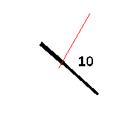

# banglejs-2-analog-clock-construction-kit #

a simple "kit" to easily construct individual analog clocks for a Bangle.js 2

Developing an "analog clock" for the [Bangle.js 2](https://www.espruino.com/Bangle.js2) may not be too complicated - but it still requires some knowledge of JavaScript in general and the [Bangle.js environment](https://www.espruino.com/Reference) in particular.

And quite often, an existing clock already comes quite close to what one would like to see - wouldn't there be the small missing detail one cannot live without...

This kit tries to simplify development and customization of such clocks by splitting the implementation into commonly seen parts and providing a framework into which all these parts fit.

As a consequence, people may easily combine already existing (and tested) parts in order to get the desired clock and - if this approach is not already sufficient - to customize or implement only those parts which cannot yet be found elsewhere.

> Just a small note: if you like this module and plan to use it, consider "starring" this repository (you will find the "Star" button on the top right of this page), so that I know which of my repositories to take most care of.

## Common Structure of an Analog Clock ##

A minimal example for an analog clock based on the "analog Clock Construction Kit" looks as follows:

```
let Clockwork = require('https://raw.githubusercontent.com/rozek/banglejs-2-simple-clockwork/main/Clockwork.js');
Clockwork.windUp();
```

and already produces the following clock:


Normally, however, a more sophisticated and detailled clock is desired. A more typical structure of an analog clock therefore looks as follows:

```
let Clockwork = require('https://raw.githubusercontent.com/rozek/banglejs-2-simple-clockwork/main/Clockwork.js');

Clockwork.windUp({
  size:      null,
  background:null,
  face:      require('https://raw.githubusercontent.com/rozek/banglejs-2-twelve-fold-face/main/ClockFace.js'),
  hands:     require('https://raw.githubusercontent.com/rozek/banglejs-2-hollow-clock-hands/main/ClockHands.js'),
  complications:{
    b:require('https://raw.githubusercontent.com/rozek/banglejs-2-date-complication/main/Complication.js')
  }
},{ withDots:true, Seconds:'#FFFF00' });
```

This code implements the following clock:


Basically, the code shown above

* loads a "clockwork" (this is responsible for the overall behaviour of a clock)
* loads any desired feature (e.g., a face with 12 numerals, stylish hollow clock hands and a complication to display the current date
* configures all these parts and then
* actually starts the clock by "winding up" its clockwork.

As you can see, quite often no real programming is required - and if something should be missing (or not meet your expectations), only that part of the clock has actually to be developed by yourself.

## Parts of an Analog Clock ##

In the context of this kit, an analog clock consists of the following parts:

* a **clockwork** (defines the overall behaviour of a clock)
* a **clock size calculator** (computes the space a clock may occupy without disturbing any widgets)
* a **clock background** (draws a background for the clock)
* a **clock face** (draws the clock's face)
* **clock hands** (actually display the current time by drawing any clock hands)
* optional **complications** (draw additional complications - e.g., to show the current date) 

### Already available Parts ###

Right now, the following clock part implementations are available:

* clockworks:
    * [simple clockwork](https://github.com/rozek/banglejs-2-simple-clockwork) with up to 6 complications
* clock size calculations:
    * [simple clock size calculation](https://github.com/rozek/banglejs-2-simple-clock-size)
    * [smart clock size calculation](https://github.com/rozek/banglejs-2-smart-clock-size) - should be combined with "[Widgets on Background](https://github.com/rozek/banglejs-2-widgets-on-background)"
* clock backgrounds:
    * [bitmap background](https://github.com/rozek/banglejs-2-bitmap-clock-background) - should be combined with "[Widgets on Background](https://github.com/rozek/banglejs-2-widgets-on-background)"
* clock faces:
    * [clock face with numbers 3, 6, 9 and 12](https://github.com/rozek/banglejs-2-four-fold-clock-face)
    * [clock face with numbers 1...12](https://github.com/rozek/banglejs-2-twelve-fold-clock-face)
    * [clock face with numbers 1...12 in "rainbow" colors](https://github.com/rozek/banglejs-2-rainbow-clock-face)
* clock hands:
    * [simple clock hands](https://github.com/rozek/banglejs-2-simple-clock-hands)
    * [rounded clock hands](https://github.com/rozek/banglejs-2-rounded-clock-hands)
    * [hollow hands](https://github.com/rozek/banglejs-2-hollow-clock-hands), optionally filled
* complications:
    * [complication placeholder](https://github.com/rozek/banglejs-2-complication-placeholder) for testing purposes
    * [date display](https://github.com/rozek/banglejs-2-date-complication)

### Clockworks ###

"Clockworks" define the overall behaviour of a clock, e.g.

* whether widgets should be shown,
* whether, how many and where complications may be drawn,
* when and how often the display should be refreshed

```
let Clockwork = require(...);
Clockwork.windUp({
  size:      <opt. clock size calculator>,
  background:<opt. clock background>,
  face:      <opt. clock face>,
  hands:     <opt. clock hands>,
  complications:{ <opt. set of complications and where to place them> }
},{ <settings> });
```

The `complications` setting is an object with the following fields (all of them are optional):

* `tl` - top left corner
* `t` - top edge
* `tr` - top right corner
* `l` - left edge
* `r` - right edge
* `bl` - bottom left corner
* `b` - bottom edge
* `br` - bottom right corner

Just assign a complication to any of these keys in order to place it at the position that key stands for. Complications assigned to `tl`, `tr`, `l`, `r`, `bl` or `br` will be allocated a small region only, while complications assigned to `t` or `b` may become a bit larger. However, complications in field `t` will prevent complications in fields `tl` and `tr` from being shown. Similarly, if a complication is assigned to field `b`, fields `bl` and `br` will be ignored.

The following two screenshots illustrate, how the mentioned keys correlate with size and position of a complication:

<table>
 <tr valign="top">
   <td align="center"><br>small complications only</td>
   <td align="center"><br>small and large complications</td>
 </tr>
</table>

The actually available space for any complication depends on the actual radius of the clock (which itself depends on the clock size calculator used and the visible widgets) and is passed to its drawing function as a value for parameter `Radius`.

### Clock Size Calculators ###

"Clock Size Calculators" determine position and radius of an analog clock such that the resulting clock becomes as large as possible even while widgets are being shown.

<table>
 <tr valign="top">
   <td align="center"><br><a href="https://github.com/rozek/banglejs-2-simple-clock-size">simple Clock Size Calculator</a></td>
   <td align="center"><br><a href="https://github.com/rozek/banglejs-2-smart-clock-size">smart Clock Size Calculator</a></td>
 </tr>
</table>

By default, the [smart clock size calculator](https://github.com/rozek/banglejs-2-smart-clock-size) is used since it often leads to larger clock faces (as illustrated by the screenshots shown above).

If you prefer a different implementation, just `require` that module and assign it to key `size` of your clockwork options:

```
let Clockwork = require(...);
Clockwork.windUp({
  size: require('...'),
}});
```

### Clock Backgrounds ###

"Clock Backgrounds" draw a background for the clock (covering the full display, regardless what the "clock size calculator" returns for the clock itself).

<table>
 <tr valign="top">
   <td align="center"><br><a href="https://github.com/rozek/banglejs-2-bitmap-clock-background">Bitmap Background</a></td>
 </tr>
</table>

By default, the clock background is filled either with `Settings.Background` or with the current theme's background color.

If you prefer a different background, just `require` the module with your preferred background and assign it to key `background` of your clockwork options:

```
let Clockwork = require(...);
Clockwork.windUp({
  background: require('...'),
}});
``` 

### Clock Faces ###

"Clock Faces" draw the face of an analog clock.

<table>
 <tr valign="top">
   <td align="center"><br><a href="https://github.com/rozek/banglejs-2-four-fold-clock-face">four-fold Clock Face</a></td>
   <td align="center"><br><a href="https://github.com/rozek/banglejs-2-twelve-fold-clock-face">twelve-fold Clock Face</a></td>
   <td align="center"><br><a href="https://github.com/rozek/banglejs-2-rainbow-clock-face">"Rainbow" Clock Face</a></td>
 </tr>
</table>

By default, no clock face is drawn.

If you prefer a specific clock face, just `require` the module with your preferred implementation and assign it to key `face` of your clockwork options:

```
let Clockwork = require(...);
Clockwork.windUp({
  face: require('...'),
}});
``` 

### Clock Hands ###

"Clock Hands" actually show the current time by drawing the hands of an analog clock.

<table>
 <tr valign="top">
   <td align="center"><br><a href="https://github.com/rozek/banglejs-2-simple-clock-hands">simple Clock Hands</a></td>
   <td align="center"><br><a href="https://github.com/rozek/banglejs-2-rounded-clock-hands">rounded Clock Hands</a></td>
   <td align="center"><br><a href="https://github.com/rozek/banglejs-2-hollow-clock-hands">hollow Clock Hands</a></td>
   <td align="center"><br><a href="https://github.com/rozek/banglejs-2-hollow-clock-hands">hollow Clock Hands (filled)</a></td>
 </tr>
</table>

By default, [rounded clock hands](https://github.com/rozek/banglejs-2-rounded-clock-hands) are drawn.

If you prefer different clock hands, just `require` the module with your preferred implementation and assign it to key `hands` of your clockwork options:

```
let Clockwork = require(...);
Clockwork.windUp({
  hands: require('...'),
}});
``` 

### Complications ###

"Complications" are optional tiny displays for additional information such as the current date, the current weekday, moon phases, etc.

<table>
 <tr valign="top">
   <td align="center"><br><a href="https://github.com/rozek/banglejs-2-date-complication">small Date Complication</a></td>
   <td align="center"><br><a href="https://github.com/rozek/banglejs-2-date-complication">large Date Complication</a></td>
 </tr>
</table>

By default, no complications are drawn.

If you prefer one or multiple complications, just `require` the modules with their implementations and assign them to the key of your clockwork option `complications` which stands for the desired position and size:

```
let Clockwork = require(...);
Clockwork.windUp({
  complications: {
    l: require(...),
    r: require(...),
    b: require(...)
  },
}});
``` 

Complications do not necessarily have to be circular - indeed, complications at the top position (`t`) or at the bottom position (`b`) are allowed to be three times as wide as others.

## How to Implement your own Parts ##

### Clockworks ###

"Clockworks" define the overall behaviour of a clock, e.g.

* whether widgets should be shown,
* whether, how many and where complications may be drawn,
* when and how often the display should be refreshed

They export the following function:

* `windUp (Options, Settings)` - starts the implemented clock as specified by the given `Options` and configured by the given `Settings`

A template for your own clockwork could therefore look as follows:

```
(function () {
  exports.windUp = function windUp (Options, Settings) { ... };
})();
```

Just use this template to implement your own clockwork and publish it in a way that Espruino may `require` it. You may also use the [simple Clockwork](https://github.com/rozek/banglejs-2-simple-clockwork) as code base to start from.

### Clock Size Calculators ###

"Clock Size Calculators" determine position and radius of an analog clock such that the resulting clock becomes as large as possible even while widgets are being shown.

They export the following functions:

* `CenterX ()` - returns the optimal x coordinate of the clocks center
* `CenterY ()` - returns the optimal y coordinate of the clocks center
* `outerRadius ()` - returns the largest possible clock radius (assuming that `CenterX()` and `CenterY()` are used)

A template for your own calculator could therefore look as follows:

```
(function () {
  exports.CenterX = function CenterX () { ... };
  exports.CenterY = function CenterY () { ... };
  exports.outerRadius = function outerRadius () { ... };
})();
```

Just use this template to implement your own clock size calculator and publish it in a way that Espruino may `require` it. You may also use the [simple Clock Size Calculator](https://github.com/rozek/banglejs-2-simple-clock-size) as code base to start from.

### Clock Backgrounds ###

"Clock Backgrounds" draw a background for the clock (covering the full display, regardless what the "clock size calculator" returns for the clock itself).

They export the following function

* `draw (Settings)` - draws the clock background as specified in the `Settings`

A template for your own background could therefore look as follows:

```
(function () {
  exports.draw = function draw (Settings) { ... };
})();
```

Just use this template to implement your own clock background and publish it in a way that Espruino may `require` it. You may also use the [Bitmap Clock Background](https://github.com/rozek/banglejs-2-bitmap-clock-background) as code base to start from.

### Clock Faces ###

"Clock Faces" draw the face of an analog clock.

They export the following function:

* `draw (Settings, CenterX, CenterY, outerRadius)` - draws a clock face as specified by the given `Settings`, centered at `CenterX`,`CenterY` and (if round) with a radius less or equal to `outerRadius`

A template for your own clock face could therefore look as follows:

```
(function () {
  exports.draw = function draw (Settings, CenterX, CenterY, outerRadius) { ... };
})();
```

Just use this template to implement your own clock face and publish it in a way that Espruino may `require` it. You may also use the [twelve-fold Clock Face](https://github.com/rozek/banglejs-2-twelve-fold-clock-face) as code base to start from.

### Clock Hands ###

"Clock Hands" actually show the current time by drawing the hands of an analog clock.

They export the following function:

* `draw (Settings, CenterX, CenterY, outerRadius, Hours, Minutes, Seconds)` - draws clock hands for the time given by `Hours`, `Minutes` and `Seconds` as specified by the given `Settings`, centered at `CenterX`,`CenterY`, with a radius less or equal to `outerRadius`. `Seconds` are optional and may be missing - in such a case, no second hand should be drawn.

A template for your own clock hands could therefore look as follows:

```
(function () {
  exports.draw = function draw (
    Settings, CenterX, CenterY, outerRadius, Hours, Minutes, Seconds
  ) { ... };
})();
```

Just use this template to implement your own clock hands and publish it in a way that Espruino may `require` it. You may also use the [simple Clock Hands](https://github.com/rozek/banglejs-2-simple-clock-hands) as code base to start from.

### Complications ###

"Complications" are optional tiny displays for additional information such as the current date, the current weekday, moon phases, etc.

They export the following function:

*  `draw (x,y, Radius, Settings)` - draws the complication as specified by the given `Settings`, centered at `x`,`y` and with a radius less than or equal `Radius`

A template for your own complication could therefore look as follows:

```
(function () {
  exports.draw = function draw (x,y, Radius, Settings) { ... };
})();
```

Just use this template to implement your own complication and publish it in a way that Espruino may `require` it. You may also use the [Date Complication](https://github.com/rozek/banglejs-2-date-complication) as code base to start from.

Complications do not necessarily have to be circular - the given `radius` is just a hint telling the complication how much space it may occupy.

Indeed, complications at the top position (`t`) or at the bottom position (`b`) are allowed to cover a horizontal span from `x-3*Radius` to `x+3*Radius` (and the same vertical span as small complications: `y-Radius`...`y+Radius`)

## License ##

[MIT License](LICENSE.md)
