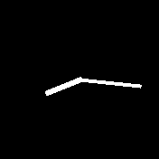
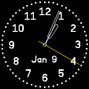

# banglejs-2-analog-clock-construction-kit #

a simple "kit" to easily construct individual analog clocks for a Bangle.js 2

Developing an "analog clock" for the [Bangle.js 2](https://www.espruino.com/Bangle.js2) may not be too complicated - but it still requires some knowledge of JavaScript in general and the [Bangle.js environment](https://www.espruino.com/Reference) in particular.

And quite often, an existing clock already comes quite close to what one would like to see - wouldn't there be the small missing detail one cannot live without...

This kit tries to simplify development and customization of such clocks by splitting the implementation into commonly seen parts and providing a framework into which all these parts fit.

As a consequence, people may easily combine already existing (and tested) parts in order to get the desired clock and - if this approach is not already sufficient - to customize or implement only those parts which cannot yet be found elsewhere.

## Common Structure of an Analog Clock ##

A minimal example for an analog clock based on the "analog Clock Construction Kit" looks as follows:

```
let Clockwork = require('https://raw.githubusercontent.com/rozek/banglejs-2-simple-clockwork/main/Clockwork.js');
Clockwork.windUp();
```

and produces the following clock:



Normally, however, a more sophisticated and detailled clock is desired.


A more typical structure of an analog clock therefore looks as follows:

```
let Clockwork = require('https://raw.githubusercontent.com/rozek/banglejs-2-simple-clockwork/main/Clockwork.js');

Clockwork.windUp({
  size:      require('https://raw.githubusercontent.com/rozek/banglejs-2-smart-clock-size/main/ClockSize.js'),
  background:null,
  face:      require('https://raw.githubusercontent.com/rozek/banglejs-2-twelve-fold-face/main/ClockFace.js'),
  hands:     require('https://raw.githubusercontent.com/rozek/banglejs-2-hollow-clock-hands/main/ClockHands.js'),
  complications:{
    b:require('https://raw.githubusercontent.com/rozek/banglejs-2-date-complication/main/Complication.js')
  }
},{ withDots:true, Seconds:'#FFFF00' });
```

This code implements the following clock:



Basically, the code shown above

* loads a "clockwork" (this is responsible for the overall behaviour of a clock)
* loads any desired feature (e.g., a "smart clock size calculation" for a larger clock face, a face with 12 numerals, stylish hollow clock hands and a complication to display the current date
* configures all these parts and then
* actually starts the clock by "winding up" its clockwork.

In this example, no real programming is required - and if anything is missing (or not as you would prefer it), only that part of the clock has actually to be developped.

## Parts of an Analog Clock ##

In the context of this kit, an analog clock consists of the following parts:

* **clockworks** (define the overall behaviour of a clock)
* **clock size calculators** (compute the space a clock may occupy without disturbing any widgets)
* **clock backgrounds** (draw a background for the clock)
* **clock faces** (draw the clock's face)
* **clock hands** (actually display the current time by drawing any clock hands)
* **complications** (optionally draw additional complications - e.g., to show the current date) 

## Already available Parts ##

Right now, the following clock parts are available:

* clockworks:
    * [simple clockwork](https://github.com/rozek/banglejs-2-simple-clockwork) with up to 6 complications
* clock size calculations:
    * [simple clock size calculation](https://github.com/rozek/banglejs-2-simple-clock-size)
    * [smart clock size calculation](https://github.com/rozek/banglejs-2-smart-clock-size) - should be combined with "[Widgets on Background](https://github.com/rozek/banglejs-2-widgets-on-background)"
* clock backgrounds:
    * [bitmap background](https://github.com/rozek/banglejs-2-bitmap-clock-background) - should be combined with "[Widgets on Background](https://github.com/rozek/banglejs-2-widgets-on-background)"
* clock faces:
    * [clock face with numbers 3, 6, 9 and 12](https://github.com/rozek/banglejs-2-four-fold-clock-face)
    * [clock face with numbers 1...12](https://github.com/rozek/banglejs-2-twelve-fold-clock-face)
    * [clock face with numbers 1...12 in "rainbow" colors](https://github.com/rozek/banglejs-2-rainbow-clock-face)
* clock hands:
    * [simple clock hands](https://github.com/rozek/banglejs-2-simple-clock-hands)
    * [rounded clock hands](https://github.com/rozek/banglejs-2-rounded-clock-hands)
    * [hollow hands](https://github.com/rozek/banglejs-2-hollow-clock-hands), optionally filled
* complications:
    * [complication placeholder](https://github.com/rozek/banglejs-2-complication-placeholder) for testing purposes
    * [date](https://github.com/rozek/banglejs-2-date-complication)

## Clockworks ##

"Clockworks" define the overall behaviour of a clock, e.g.

* whether widgets should be shown,
* whether, how many and where complications may be drawn,
* when and how often the display should be refreshed

```
let Clockwork = require(...);
Clockwork.windUp({
  size:      <opt. clock size calculator>,
  background:<opt. clock background>,
  face:      <opt. clock face>,
  hands:     <opt. clock face>,
  complications:{ <opt. set of complications and where to place them> }
},{ <settings> });
```

The `complications` object has the following fields (all of them are optional):

* `tl` - a complication assigned to this field is placed in the top left corner of the complications area
* `t` - for complications at the top edge of the available area. If `t` is set, `tl` and `tr` are ignored
* `tr` - a complication assigned to this field is placed in the top right corner of the complications area
* `l` - for complications at the left edge of the available area
* `r` - for complications at the right edge of the available area
* `bl` - a complication assigned to this field is placed in the bottom left corner of the complications area
* `b` - for complications at the bottom edge of the available area. If `b` is set, `bl` and `br` are ignored
* `br` - a complication assigned to this field is placed in the bottom right corner of the complications area

The following two screenshots illustrate, how these keys correlate with size and position of a complication:

<table>
 <tr valign="top">
   <td align="center"><br>small complications only</td>
   <td align="center"><br>small and large complications</td>
 </tr>
</table>

## Clock Size Calculators ##

"Clock Size Calculators" determine position and radius of an analog clock such that the resulting clock becomes as large as possible even while widgets are being shown.

<table>
 <tr valign="top">
   <td align="center"><br><a href="https://github.com/rozek/banglejs-2-simple-clock-size">simple Clock Size Calculator</a></td>
   <td align="center"><br><a href="https://github.com/rozek/banglejs-2-smart-clock-size">smart Clock Size Calculator</a></td>
 </tr>
</table>

They export the following functions:

* `CenterX ()` - returns the optimal x coordinate of the clocks center
* `CenterY ()` - returns the optimal y coordinate of the clocks center
* `outerRadius ()` - returns the largest possible clock radius (assuming that `CenterX()` and `CenterY()` are used)

If no clock size calculator is specified, the [smart clock size calculator](https://github.com/rozek/banglejs-2-smart-clock-size) is used as it often leads to larger clock faces (as illustrated by the screenshots shown above).

## Clock Backgrounds ##

"Clock Backgrounds" draw a background for the clock (covering the full display, regardless what the "clock size calculator" returns for the clock itself).

They export the following function

* `draw (Settings)` - draws the clock background as specified in the `Settings`

If no explicit background is specified, the display will be filled either with `Settings.Background` or with the current theme's background color.

## Clock Faces ##

"Clock Faces" draw the face of an analog clock.

They export the following function:

* `draw (Settings, CenterX, CenterY, outerRadius)` - draws a clock face as specified by the given `Settings`, centered at `CenterX`,`CenterY` and (if round) with a radius less or equal to `outerRadius`

If no explicit clock face is specified, no face will be drawn.

## Clock Hands ##

"Clock Hands" actually show the current time by drawing the hands of an analog clock.

They export the following function:

* `draw (Settings, CenterX, CenterY, outerRadius, Hours, Minutes, Seconds)` - draws clock hands for the time given by `Hours`, `Minutes` and `Seconds` as specified by the given `Settings`, centered at `CenterX`,`CenterY`, with a radius less or equal to `outerRadius`. `Seconds` are optional and may be missing - in such a case, no second hand should be drawn.

If no explicit clock hand provider is given, [simple clock hands](https://github.com/rozek/banglejs-2-simple-clock-hands) will be drawn.

## Complications ##

"Complications" are optional tiny displays for additional information such as the current date, the day-of-the week, moon phases, etc.

They export the following function:

*  `draw (x,y, Radius, Settings)` - draws the complication as specified by the given `Settings`, centered at `x`,`y` and with a radius less than or equal `Radius`

Complications do not necessarily have to be circular - the given `radius` is just a hint telling the complication how much space it may occupy.

Indeed, there are two special cases: complications at the

* top position `t` and those at the
* bottom position `b`

In these two cases, complications are allowed to cover a horizontal span from `x-3*Radius` to `x+3*Radius` (and the same vertical span as small complications: `y-Radius`...`y+Radius`)

If no complications are specified, no will be drawn.

## License ##

[MIT License](LICENSE.md)
